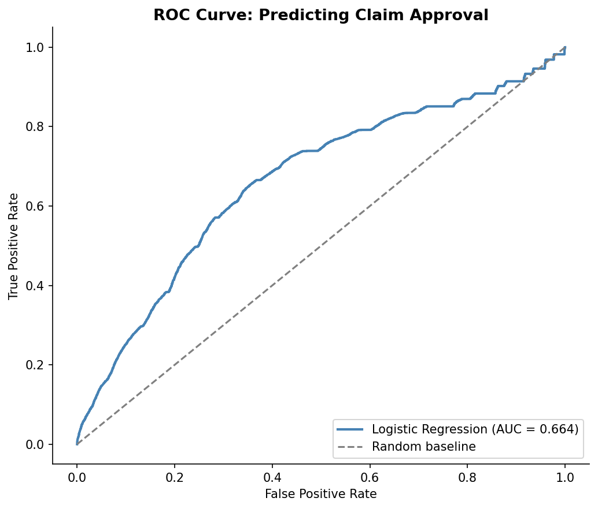
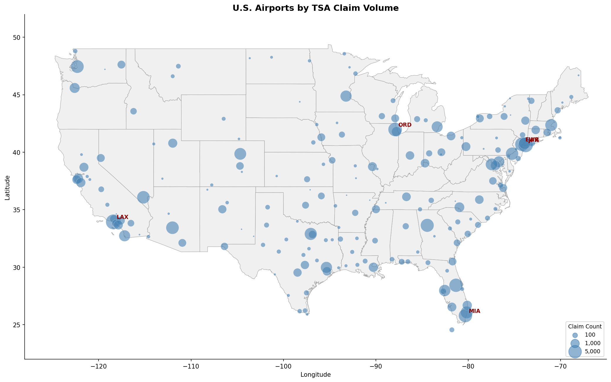

# TSA Insurance Claims Analysis

An end-to-end exploratory and predictive analysis of public TSA claims data, looking at where claims happen, what they cost, how often the TSA pays out, and whether claim outcomes can be predicted from the available features.

The notebook is committed with all cells executed, so the charts, tables, and model results render inline on GitHub.

## Preview

The approval model (balanced logistic regression) judged on held-out claims, alongside the map of where claims cluster across U.S. airports.

| Model performance (ROC) | Where claims happen |
|-------------------------|---------------------|
|  |  |

## What's in here

- **`tsa_claims_analysis.ipynb`** - the full analysis notebook
- **`figures/`** - rendered charts saved during the run
- **`data/`** - place the source CSVs here (see Data section below)

## Highlights

- Cleaned roughly 200K rows of TSA claims data, including currency parsing, date parsing, and Status normalization
- Eight descriptive questions answered with both tables and charts (claim types, sites, amounts, payout percentages, top airports, time trends)
- Geographic visualization of all U.S. airports with claim activity using GeoPandas, scaled by claim volume
- Logistic regression model predicting whether a claim will be approved, with feature-importance breakdown showing which claim types and locations drive approval odds

## Tools

Python 3.11, pandas, NumPy, matplotlib, GeoPandas, Shapely, scikit-learn.

## Data

The notebook expects the following files in a `data/` folder at the repo root:

- `tsa_claims2.csv` - TSA Claims Data (publicly available on data.gov: https://www.dhs.gov/tsa-claims-data)
- `GlobalAirportDatabase.csv` - airport coordinates (https://www.partow.net/miscellaneous/airportdatabase/)
- `maps.zip` - U.S. states shapefile, extracted automatically on first run

The full claims file is around 35 MB so it is excluded from version control via `.gitignore`. Drop it in `data/` after cloning.

## Running it

```bash
pip install -r requirements.txt
jupyter notebook tsa_claims_analysis.ipynb
```

Run the cells top to bottom. Figures will save to `figures/`.

## Next steps

If I extended this I would normalize claim counts by passenger volume per airport (so I am measuring rate, not raw count), try a tree-based model for the approval predictor, and break the geographic view down by claim type so you can see whether certain regions skew toward different incident kinds.
