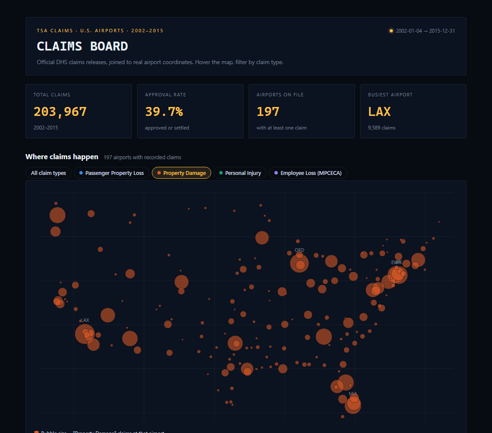

# TSA Insurance Claims Analysis

An end-to-end exploratory and predictive analysis of public TSA claims data, looking at where claims happen, what they cost, how often the TSA pays out, and whether claim outcomes can be predicted from the available features.

The notebook is committed with all cells executed, so the charts, tables, and model results render inline on GitHub.

**Interactive companion:** https://kelsonlam.github.io/tsa-airport-claims/ — a
hoverable, filterable map of real claim volume by airport (built from the
official DHS releases below, not the notebook's synthetic stand-in), since a
map and a set of category breakdowns are the parts of this analysis that
actually benefit from hovering and filtering. The model diagnostics stay as
static images there too; a ROC curve doesn't gain much from being interactive.

## Preview

The approval model (balanced logistic regression) judged on held-out claims, alongside the interactive claims map (screenshot; the live version above is hoverable and filterable by claim type).

| Model performance (ROC) | Where claims happen |
|-------------------------|---------------------|
|  |  |

## What's in here

- **`tsa_claims_analysis.ipynb`** - the full analysis notebook
- **`figures/`** - rendered charts saved during the run
- **`scripts/build_interactive_map.py`** - builds the interactive companion page (`docs/index.html`) from real DHS data
- **`data/`** - place the source files here (see Data section below)

## Highlights

- Cleaned roughly 200K rows of TSA claims data, including currency parsing, date parsing, and Status normalization
- Eight descriptive questions answered with both tables and charts (claim types, sites, amounts, payout percentages, top airports, time trends)
- Geographic visualization of all U.S. airports with claim activity using GeoPandas, scaled by claim volume
- Logistic regression model predicting whether a claim will be approved, with feature-importance breakdown showing which claim types and locations drive approval odds

## Tools

Python 3.11, pandas, NumPy, matplotlib, GeoPandas, Shapely, scikit-learn.

## Data

The notebook expects the following files in a `data/` folder at the repo root:

- `tsa_claims2.csv` - TSA Claims Data (publicly available on data.gov: https://www.dhs.gov/tsa-claims-data)
- `GlobalAirportDatabase.csv` - airport coordinates (https://www.partow.net/miscellaneous/airportdatabase/)
- `maps.zip` - U.S. states shapefile, extracted automatically on first run

The full claims file is around 35 MB so it is excluded from version control via `.gitignore`. Drop it in `data/` after cloning.

A recent pass fixed a date-parsing edge case (two-digit years like "17-May-55"
were parsing to 2055 and flowing uncorrected into the approval model) and a
label collision on the airport map (JFK and EWR sit close enough that their
labels used to overlap into unreadable text). Both fixes are verified against
a synthetic stand-in dataset with the same schema, since the real
`tsa_claims2.csv`/`GlobalAirportDatabase.csv` pairing the notebook expects
requires reconciling several years of differing DHS column schemas that this
pass didn't take on; `figures/geo_map.png` and the date-range print in the
notebook still reflect the pre-fix run and will refresh the next time this
notebook runs against the real dataset.

### Data for the interactive map (`scripts/build_interactive_map.py`)

This one *is* built from real data, sourced separately from the notebook's
pairing above since it only needs the columns every era of the DHS release
shares (date, airport, claim type, claim site, disposition), not the fuller
schema the notebook's ingestion expects. Download into `data/raw/`:

- The five official DHS claims files, https://www.dhs.gov/tsa-claims-data :
  `claims-2002-2006_0.xls`, `claims-2007-2009_0.xls`, `claims-2010-2013_0.xls`,
  `claims-2014.xls`, `claims-data-2015-as-of-feb-9-2016.xlsx`
- `GlobalAirportDatabase.txt` (raw colon-delimited format), https://www.partow.net/miscellaneous/airportdatabase/

Then run `python scripts/build_interactive_map.py`, which writes the small
derived `data/tsa_claims_geo.json` (committed; ~200K real claims reduced to
per-airport aggregates, ~60 KB) and regenerates `docs/index.html`.

## Running it

```bash
pip install -r requirements.txt
jupyter notebook tsa_claims_analysis.ipynb
```

Run the cells top to bottom. Figures will save to `figures/`.

## Next steps

If I extended this I would normalize claim counts by passenger volume per airport (so I am measuring rate, not raw count), try a tree-based model for the approval predictor, and break the geographic view down by claim type so you can see whether certain regions skew toward different incident kinds.
